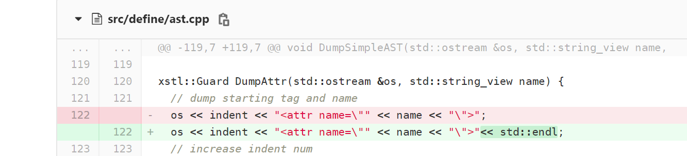
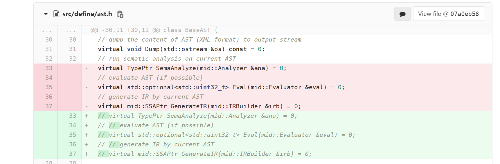
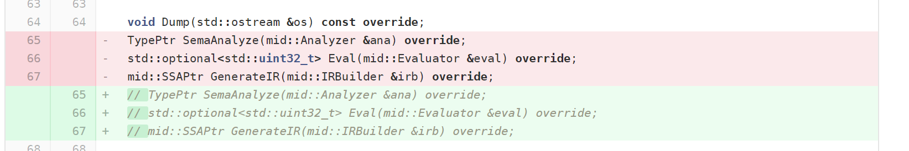

## 前端初步

### 对front外文件的变更

- 加了一处xml换行



- 前端这部分不考虑，注释以正确编译



- 增加src/main.cpp

  目前没啥用，可删除


### src/front文件

- 必须文件
  - 原有
    - logger.h
    - logger.cpp
  - 写的
    - parserctx.h
  - flex生成
    - lex.yy.c
  - bison生成
    - parser.tab.cc
    - parser.tab.hh
    - location.hh
    - position.hh
    - stack.hh
- 其他
  - `bison-3.6.tar.gz` bison安装包
  - `lexer.l` flex源文件
  - `parser.y` bison源文件
  - `Makefile` 编译生成myparser
  - `myparser` 读入sysy文件(argv[1])输出ast
  - `functional_test` 提供的功能用例
  - `gen_test.py` 生成批量运行脚本
  - `test.sh` 脚本
  - `test.log` 每个功能用例的ast输出


### ParserCtx

管理输入文件fp、logger及提供MakeAST方法，传递ast

```c++
struct ParserCtx {
  FILE* fp;
  Logger logger;
  define::ASTPtr ast;

  ParserCtx(char* file){
    fp=fopen(file,"r");
  };

  void finish(){
    fclose(fp);
    fp=NULL;
  }

  // create a new AST
  template <typename T, typename... Args>
  define::ASTPtr MakeAST(Args &&... args) {
    auto ast = std::make_unique<T>(std::forward<Args>(args)...);
    ast->set_logger(logger);
    return ast;
  }

  // log error and return null pointer
  define::ASTPtr LogError(std::string_view message){
      logger.LogError(message);
      return nullptr;
  };
};
```


### logger

暂时没用到


### AST修正

#### 一些bison说明

- `%define api.value.automove` 自动加上std::move
- `%nterm \<type>` 表示非终结符对应的变量类型
- `{ 语句;...; }` 归约动作Action
- `$` :$$ 表示非终结符，$1~$n 表示候选式相应文法符号
- 没写Action的，自动应用$$=$1(也会应用automove)
- 其他细节对理解生成AST没有影响

#### 问题

- lval may be IdAST/VarDefAST

  ```
  lval
    : ident {$$=ctx.MakeAST<IdAST>($1);}
    | ident arr_exps {$$=ctx.MakeAST<VarDefAST>($1,$2,nullptr);}
    ;
  ```

- `ident arr_exps` seems no corresponding AST,so use VarDefAST

- exp maybe BinaryAST/UnaryAST/IntAST(number)/typeof(lval)

- const_init_val/init_val maybe InitListAST/typeof(exp)

- as an ASTPtrList(vector),`$$=$1`may be inefficient,but `$$.swap($1)` is invalid

  ```
  const_defs
    : const_def {$$.emplace_back($1);}
    | const_defs ',' const_def {$1.emplace_back($3);$$=$1;}
    ;
  ```

- ...